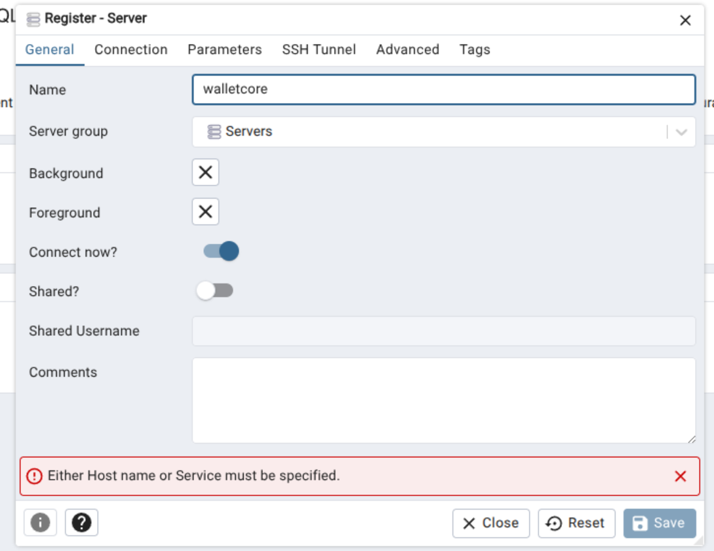
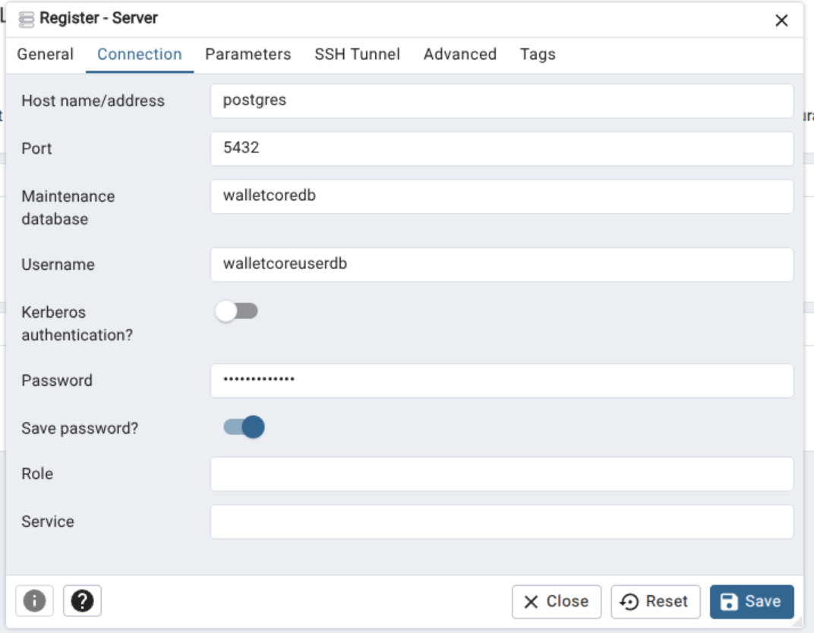

# EDA - Event Driven Architecture

Projeto para estudo da arquitetura orientada a eventos.

## Principais endereços

Para acessar os containers:

- PgAdmin4
  - [http://localhost:1580/login](http://localhost:1580/login)
- UI for Apache Kafka
  - [http://localhost:8092/](http://localhost:8092/)
- Prometheus
  - [http://localhost:9090/](http://localhost:9090/)
- keycloak
  - [http://localhost:9091/](http://localhost:9091/)
- Swagger da aplicação walletcore
  - [http://localhost:3002/walletcore/api/v1/swagger-ui/index.html](http://localhost:3002/walletcore/api/v1/swagger-ui/index.html)
- Swagger da aplicação balances
  - [http://localhost:3003/balances/api/v1/swagger-ui/index.html](http://localhost:3003/balances/api/v1/swagger-ui/index.html)  

---

Conteúdo abaixo é para o desensolvedor

# Para uso no desenvolvimento

## Acessando o Postgres via PgAdmin4

Acesse p link: [http://localhost:1580/login](http://localhost:1580/login)

Configurar acesso ao servidor:



Adicione as configurações, as mesmas que estão no docker-compose. Aqui, no docker, o host do postgresql é `postgres`. Login e senha estão no docker-compose.



Após isso, temos acesso ao banco:


## keycloak

Para obter o token no keycloak, use o cUrl abaixo:

```shell
curl -X POST "http://localhost:9091/realms/wallet-realm/protocol/openid-connect/token" \
  -H "Content-Type: application/x-www-form-urlencoded" \
  -d "grant_type=client_credentials" \
  -d "client_id=wallet-client" \
  -d "client_secret=wallet-secret"
```

## Padrão de commits

Este guia detalha como configurar Husky (para hooks de Git) no seu projeto Spring Boot baseado em Maven.
Essa ferramenta, baseada em Node.js, ajuda a automatizar a qualidade de código de release do projeto Java.

As configurações já estão no `package.json`, basta rodar os comandos:

- Preparar o husky no início do projeto: `npm run prepare`.

### Commints

Para integrar o git-cz ao seu projeto Spring Boot, você precisa de três passos principais: instalação, configuração do adaptador (a estrutura de prompt) e a execução via script npm. A instalação basta executar `npm i`. A configuração já está feita.

Agora, em vez de rodar git commit, seus devs rodarão: `npm run commit`.

Isso iniciará o prompt interativo, que guiará você passo a passo:
1. Select the type of change: (feat, fix, chore, etc.)
2. Scope (opcional): (core, api, db, etc.)
3. Subject (título conciso).
4. Body (detalhes do corpo, opcional).
5. Breaking Change (se for uma mudança que quebra compatibilidade).
6. Issue reference (referência a issues).

O git-cz constrói a mensagem final no formato correto (feat(core): implementa validacao de CPF) e, em seguida, executa o git commit.


## Ciclo de Release no Java/Maven

O standard-version automatiza o versionamento e a geração do CHANGELOG.md com base em commits seguindo o Conventional Commits.

O standard-version atualizará o package.json automaticamente, mas não atualizará o <version> no seu pom.xml. Você precisará usar o Maven para isso.

Passos Manuais Envolvidos:

1. Fazer os Commits: Com commits seguindo o padrão (ex: feat: add new endpoint).
2. Rodar o standard-version: `npm run release`.

Isso fará:
- Incremento da versão no package.json.
- Criação/Atualização do CHANGELOG.md.
- Criação de um commit com as mudanças (ex: chore(release): 1.0.0).
- Criação da tag Git (ex: v1.0.0).

3. Atualizar o pom.xml: Você deve manualmente (ou com um plugin Maven como o versions-maven-plugin) sincronizar a nova versão do pom.xml com a versão gerada pelo standard-version: `mvn versions:set -DnewVersion=1.0.0 -DgenerateBackupPoms=false`


## Formatando a classe o VSCODE

Para usar o formatter no VSCODE:

- Abra as Configurações do VS Code `(Ctrl + ,)`.
- Pesquise por java.format.settings.url.
- Defina o caminho para o arquivo que você acabou de criar. Se estiver na raiz do projeto:
 - "java.format.settings.url": `${workspaceFolder}/config/fomatter/java-formatter.xml`

## Usando as tasks do vscode

Par ao vscode, está na pasta `.vscode` algumas task:

- Use o comando do VS Code `(Ctrl + shift + P)`.
- Usar `Task: Run Task`.
- Selecione a ação.
